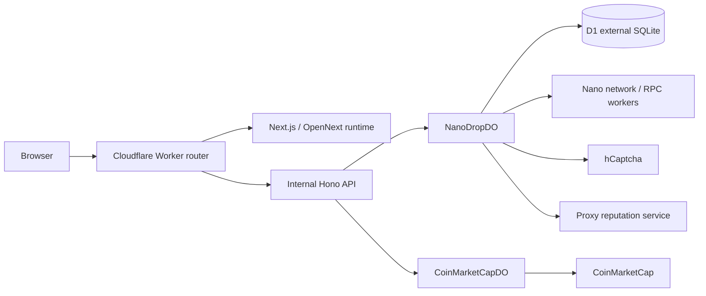

# Architecture

NanoDrop is an open source Nano (XNO) faucet. The current application is
delivered as one Cloudflare Worker deployment that combines a Next.js/OpenNext
frontend with an internal Hono API, Durable Objects, and D1.

This document is a project map for engineers joining the codebase. It explains
the main runtime boundaries, data ownership decisions, and operational tradeoffs
without documenting every route or implementation detail.

## Project Overview

The repository has two major application surfaces:

- **Public product UI**: the faucet, drop history, country map, donation page,
  terms page, price ticker, QR scanner, hCaptcha flow, and responsive theme.
- **Operator UI**: the `/admin` dashboard for wallet operations, receivables,
  faucet configuration, analytics, whitelist, and blacklist management.

The backend is not deployed as a separate service. The top-level Worker routes
requests between the OpenNext-generated Next.js runtime and the internal Hono
API. Stateful faucet behavior is coordinated through Durable Objects, while the
external SQLite database, Cloudflare D1, is the durable source of truth for drop
history and analytics.

Key entrypoints:

- `worker.ts`: unified Worker router.
- `src/api`: internal Hono API and Durable Object implementations.
- `src/app/admin`: admin dashboard and session routes.
- `d1/migrations`: external D1 schema history.

## High-Level Architecture

## Runtime Responsibilities

| Runtime area      | Responsibility                                                           | Notes                                                                                         |
| ----------------- | ------------------------------------------------------------------------ | --------------------------------------------------------------------------------------------- |
| Frontend          | Product UI, admin UI, client-side state, user interactions               | Calls same-origin `/api/*` and `/api/admin/*` paths without depending on backend internals.   |
| Worker router     | Decides whether a request goes to OpenNext or the Hono API               | Keeps one deployable unit while preserving clear runtime boundaries.                          |
| Hono API          | HTTP contract for faucet, price, wallet, admin, and analytics operations | Adapts public/admin requests to Durable Object instances.                                     |
| Durable Objects   | Stateful coordination for faucet and price workflows                     | Owns local operational state, request serialization, caches, queues, and wallet coordination. |
| D1                | External SQLite database for durable shared facts                        | Stores drop history, geo/proxy metadata, country aggregates, and analytics source data.       |
| External services | Nano RPC/workers, hCaptcha, CoinMarketCap, proxy reputation checks       | Called only from server-side runtime paths.                                                   |

## Frontend Architecture

The frontend is a Next.js application rendered through OpenNext on Cloudflare.
It is intentionally thin around domain rules: the browser collects user input,
shows status, triggers actions, and renders results, but the faucet rules live
in the backend.

The public UI uses React components and SWR hooks to load faucet status, drop
history, country aggregates, and XNO price data. The faucet form validates Nano
addresses client-side for fast feedback, then relies on the API for authoritative
readiness, verification requirements, and send results.

The hCaptcha flow is initiated by the UI, but verification is server-side. This
keeps the browser responsible for user interaction and the Worker responsible
for trust decisions.

The admin dashboard is part of the same frontend application at `/admin`. It
uses authenticated same-origin requests to manage wallet state, receivables,
faucet limits, analytics, whitelist entries, and blacklist entries. The dashboard
does not store or expose the raw admin token.

## Backend Architecture

The backend has three layers:

1. The top-level Worker router receives every request.
2. The internal Hono app exposes the API surface.
3. Durable Objects run the stateful domain workflows.

Public API requests are handled by the Hono API and routed to the appropriate
Durable Object. Non-API requests continue to the OpenNext runtime. Price requests
go to `CoinMarketCapDO`, while faucet and wallet requests go to `NanoDropDO`.

`NanoDropDO` is the coordination point for the faucet. It evaluates whether a
drop can be sent, applies anti-spam rules, tracks in-flight requests per IP,
coordinates wallet state, sends Nano transactions, and queues successful sends
for persistence in D1.

`CoinMarketCapDO` keeps a short-lived price cache. It protects the public price
endpoint from repeatedly calling CoinMarketCap while still allowing fresh data
after the cache expires.

## Admin Model

Admin access is designed so `ADMIN_TOKEN` stays server-side.

The operator signs in through `/api/admin/session`. The server compares the
submitted token and, if valid, issues a signed HttpOnly same-site session cookie.
After that, browser admin actions call `/api/admin/*`.

The admin proxy verifies the signed session cookie before forwarding the request
to the internal admin API with `Authorization: Bearer <ADMIN_TOKEN>`. This keeps
the browser session ergonomic without putting the long-lived admin secret in
client storage.

This model also preserves one operational API surface. Admin UI actions reuse the
same privileged faucet endpoints that the Worker already protects, instead of
introducing a second public admin backend.

## Storage And Source Of Truth

D1 is the external SQLite database and the source of truth for historical facts:
drop history, analytics, country aggregates, and IP geo/proxy metadata. If a
developer needs to answer what actually happened over time, D1 is the proof.

Durable Object SQL storage is used for local operational state. It can persist
inside the object, but it should be treated as coordination state rather than
the absolute historical record. The system deliberately avoids making temporary
or object-local data depend on global persistence or absolute consistency. The
authoritative record remains the external SQLite database in D1.

| Store                 | Responsibility                                                                                | Persistence expectation                           | Source of truth                                         |
| --------------------- | --------------------------------------------------------------------------------------------- | ------------------------------------------------- | ------------------------------------------------------- |
| D1 (`NANODROP_DB`)    | Drops, IP metadata, country aggregates, analytics reads                                       | Durable shared SQLite with migrations             | Yes, for history and analytics                          |
| `NanoDropDO` SQL      | Wallet state, admin settings, whitelist, blacklist, in-flight coordination, persistence queue | Local operational state scoped to the object      | No, except as the live operational state for the object |
| `CoinMarketCapDO` SQL | Price cache rows keyed by coin and currency                                                   | Short-lived cache, refreshable from CoinMarketCap | No                                                      |
| External Nano network | Account balances, frontiers, sends, receives                                                  | Network-level truth                               | Yes, for Nano ledger state                              |

### Drop Persistence

After a Nano send succeeds, `NanoDropDO` stores the drop in a local SQLite-backed
queue before returning the response. The queue is flushed to D1 in FIFO order in
the background.

Pending queue entries are included in readiness checks, so rate limits do not
ignore drops that were sent but have not reached D1 yet. If a D1 insert fails,
the Durable Object records the failure and schedules an alarm to retry the
queue.

This design keeps the user-facing send path fast while preserving D1 as the
eventual source of truth for drop history.

## Drop Lifecycle

A public drop follows this conceptual flow:

1. The browser submits a Nano account through the public faucet UI.
2. The API checks request origin, client IP, country, and account validity.
3. `NanoDropDO` evaluates readiness using wallet balance, configured limits,
   proxy rules, historical D1 counts, and queued-but-not-yet-persisted drops.
4. Blacklist checks run before whitelist exemptions, so blocked IPs or accounts
   cannot bypass moderation rules.
5. If verification is required, the backend validates the hCaptcha token before
   sending funds.
6. The wallet sends the Nano transaction and returns the hash.
7. The drop is queued locally, then persisted asynchronously to D1.
8. Public history and admin analytics read from D1 once persistence completes.

## Operational Model

Local development runs the UI and Worker API as separate local processes. The
frontend still calls same-origin API paths, while local proxying routes those
requests to the Wrangler Worker process.

Preview mode builds the OpenNext Worker and runs the unified Worker locally. Use
it when validating behavior that depends on the production routing model rather
than only the development split-process setup.

Production and staging are defined through Wrangler configuration. Durable
Object bindings are `NANODROP_DO` and `COINMARKETCAP_DO`; D1 is bound as
`NANODROP_DB`. D1 schema changes live in migrations and should be applied before
deploying code that depends on them.

The current production architecture does not require an R2-backed OpenNext
incremental cache. Faucet state, price caching, and historical data are kept in
Durable Object SQL or D1 according to the ownership boundaries above.

## Architecture Decisions

| Decision                                      | Reason                                                                                                                 |
| --------------------------------------------- | ---------------------------------------------------------------------------------------------------------------------- |
| Single deployable Worker                      | Keeps deployment simple while allowing explicit routing between frontend and backend runtimes.                         |
| Durable Object as faucet coordinator          | Provides a natural place for wallet state, per-IP serialization, operational settings, and local queues.               |
| D1 as source of truth                         | Historical drop and analytics data need an external SQLite record that is not tied to object-local coordination state. |
| Server-side admin token                       | Keeps `ADMIN_TOKEN` out of browser storage while preserving privileged faucet endpoints.                               |
| Short-lived price cache in `CoinMarketCapDO`  | Reduces external API calls without making price data a durable business record.                                        |
| No R2 dependency for the current architecture | Avoids unnecessary infrastructure while OpenNext, Durable Objects, and D1 cover the current runtime needs.             |
